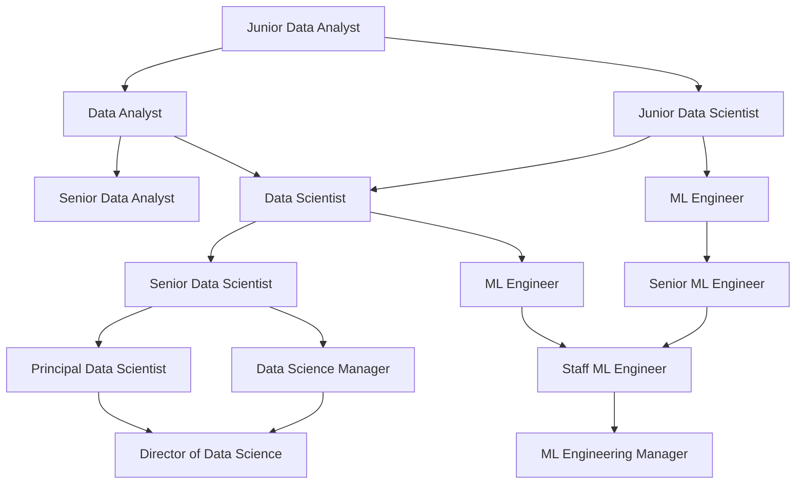

<div align="center">

# 🧠 AI  Data Scientist & AI Roadmap 🧠
### *Complete Learning Path from Zero to Hero*


<p align="center">
  
  
  
  
</p>

<p align="center">
  
</p>

---

<table>
<tr>
<td align="center" width="25%">

<br><strong>Portfolio Ready</strong>
</td>
<td align="center" width="25%">

<br><strong>Zero Cost</strong>
</td>
<td align="center" width="25%">

<br><strong>Industry Skills</strong>
</td>
<td align="center" width="25%">

<br><strong>Career Launch</strong>
</td>
</tr>
</table>

<p align="center">
  <a href="#-getting-started">
    
  </a>
  <a href="#-roadmap-overview">
    
  </a>
  <a href="#-project-portfolio">
    
  </a>
  <a href="#-resources">
    
  </a>
</p>

</div>

---

## 🎯 **Overview**

<div align="center">

**Transform from Beginner to AI & Data Science Expert** 🚀

*Complete roadmap with mathematics foundations, machine learning mastery, deep learning expertise, and production deployment skills*

</div>

<table>
<tr>
<td width="50%">

### 🎓 **What You'll Master**
- 📊 **Mathematics & Statistics** - Linear algebra, calculus, probability
- 🐍 **Programming Excellence** - Python, R, SQL mastery
- 🤖 **Machine Learning** - Supervised, unsupervised, deep learning
- 🧠 **AI & Neural Networks** - CNNs, RNNs, Transformers, LLMs
- 📈 **Data Engineering** - ETL, big data, cloud platforms
- 🚀 **MLOps & Deployment** - Production systems, monitoring
- 💼 **Portfolio Projects** - 20+ real-world applications

</td>
<td width="50%">

### 📈 **Learning Approach**
- 📖 **Theory + Practice** - Concepts with hands-on implementation
- 🛠️ **Project-Driven** - Build real applications, not just tutorials
- 🆓 **100% Free Resources** - No paid courses required
- 🌐 **Community Support** - Join global learning community
- 📊 **Progressive Path** - Clear milestones & structured learning
- 🏆 **Career Focus** - Job-ready skills and portfolio

</td>
</tr>
</table>

---

## 🛠️ **Prerequisites & Setup**

<details>
<summary><b>📋 Required Background (Click to expand)</b></summary>

### ✅ **Must Have:**
- [ ] **Basic Programming** - Any language (Python preferred)
- [ ] **High School Math** - Algebra, basic calculus
- [ ] **Statistics Basics** - Mean, median, standard deviation
- [ ] **Computer Skills** - File management, software installation

### 🔧 **Development Environment:**

```bash
# 🐍 Python Environment Setup
python -m venv ds-env
source ds-env/bin/activate  # Linux/Mac
# ds-env\Scripts\activate  # Windows

# 📊 Data Science Stack
pip install numpy pandas matplotlib seaborn
pip install scikit-learn tensorflow pytorch
pip install jupyter notebook jupyterlab
pip install plotly dash streamlit

# 🔗 MLOps & Production
pip install mlflow dvc docker-py
pip install fastapi uvicorn sqlalchemy
pip install pytest black flake8
```

### 🗂️ **Project Structure:**
```
data-science-journey/
├── 01-foundations/
├── 02-statistics/
├── 03-machine-learning/
├── 04-deep-learning/
├── 05-projects/
├── 06-deployment/
└── portfolio/
```

</details>

---

## 📍 **Roadmap Overview**

<div align="center">

</div>

<table>
<tr>
<th width="15%">📅 Phase</th>
<th width="40%">🎯 Focus Area</th>
<th width="30%">🛠️ Technologies</th>
<th width="15%">📊 Level</th>
</tr>

<tr>
<td align="center">

</td>
<td>
<b>Mathematics & Programming Foundations</b><br>
<small>Linear algebra, calculus, statistics, Python mastery</small>
</td>
<td>
<code>Python</code> <code>NumPy</code> <code>Pandas</code> <code>Matplotlib</code>
</td>
<td align="center">
🌱<br><small>Beginner</small>
</td>
</tr>

<tr>
<td align="center">

</td>
<td>
<b>Statistical Analysis & Data Exploration</b><br>
<small>Descriptive stats, hypothesis testing, EDA techniques</small>
</td>
<td>
<code>Scipy</code> <code>Seaborn</code> <code>Plotly</code> <code>Jupyter</code>
</td>
<td align="center">
🚀<br><small>Intermediate</small>
</td>
</tr>

<tr>
<td align="center">

</td>
<td>
<b>Machine Learning Mastery</b><br>
<small>Supervised, unsupervised learning, feature engineering</small>
</td>
<td>
<code>Scikit-learn</code> <code>XGBoost</code> <code>LightGBM</code> <code>Optuna</code>
</td>
<td align="center">
⚡<br><small>Advanced</small>
</td>
</tr>

<tr>
<td align="center">

</td>
<td>
<b>Neural Networks & AI</b><br>
<small>CNNs, RNNs, Transformers, computer vision, NLP</small>
</td>
<td>
<code>TensorFlow</code> <code>PyTorch</code> <code>Hugging Face</code> <code>OpenCV</code>
</td>
<td align="center">
🔥<br><small>Expert</small>
</td>
</tr>

<tr>
<td align="center">

</td>
<td>
<b>Data Engineering & Cloud</b><br>
<small>Spark, Hadoop, AWS/GCP, data pipelines</small>
</td>
<td>
<code>Apache Spark</code> <code>AWS</code> <code>Docker</code> <code>Airflow</code>
</td>
<td align="center">
🔥<br><small>Expert</small>
</td>
</tr>

<tr>
<td align="center">

</td>
<td>
<b>Production & Career</b><br>
<small>Model deployment, monitoring, portfolio building</small>
</td>
<td>
<code>MLflow</code> <code>FastAPI</code> <code>Kubernetes</code> <code>Git</code>
</td>
<td align="center">
🏆<br><small>Master</small>
</td>
</tr>

</table>

---

## 📚 **Detailed Learning Path**

### 📐 **Phase 1-2: Mathematical Foundations (Weeks 1-4)**

<details>
<summary><b>🔢 Week 1-2: Mathematics Essentials</b></summary>

<br>

<div align="center">

</div>

#### **📊 Linear Algebra (Week 1)**

<table>
<tr>
<td width="70%">

**📚 Free Resources:**
- [Khan Academy Linear Algebra](https://www.khanacademy.org/math/linear-algebra) - Complete course
- [3Blue1Brown Essence of Linear Algebra](https://www.youtube.com/playlist?list=PLZHQObOWTQDPD3MizzM2xVFitgF8hE_ab) - Visual approach
- [MIT 18.06 Linear Algebra](https://ocw.mit.edu/courses/mathematics/18-06-linear-algebra-spring-2010/) - University level

**🎯 Mini-Project:** **Image Compression with SVD** - Apply linear algebra to real images

</td>
<td width="30%">

**🔧 Daily Focus:**
- **Day 1-2:** Vectors & matrices
- **Day 3-4:** Matrix operations
- **Day 5-6:** Eigenvalues & eigenvectors
- **Day 7:** SVD & applications

</td>
</tr>
</table>

#### **🧮 Calculus & Optimization (Week 2)**

<table>
<tr>
<td width="70%">

**📚 Free Resources:**
- [Khan Academy Calculus](https://www.khanacademy.org/math/calculus-1) - Fundamentals
- [Paul's Online Math Notes](https://tutorial.math.lamar.edu/) - Comprehensive guide
- [Optimization for ML](https://www.youtube.com/watch?v=sDv4f4s2SB8) - Practical focus

**🎯 Mini-Project:** **Gradient Descent Visualizer** - Build optimization algorithm

</td>
<td width="30%">

**🔧 Daily Focus:**
- **Day 8-9:** Derivatives & gradients
- **Day 10-11:** Partial derivatives
- **Day 12-13:** Optimization methods
- **Day 14:** Gradient descent implementation

</td>
</tr>
</table>

</details>

<details>
<summary><b>🐍 Week 3-4: Python for Data Science</b></summary>

<br>

<div align="center">

</div>

#### **🐍 Python Fundamentals (Week 3)**

<table>
<tr>
<td width="70%">

**📚 Free Resources:**
- [Python for Everybody](https://www.py4e.com/) - Complete course
- [Automate the Boring Stuff](https://automatetheboringstuff.com/) - Practical Python
- [Real Python](https://realpython.com/) - Advanced tutorials

**🎯 Project:** **Data Analysis CLI Tool** - Command-line data processor

</td>
<td width="30%">

**🔧 Daily Focus:**
- **Day 15-16:** Python basics & OOP
- **Day 17-18:** File handling & APIs
- **Day 19-20:** NumPy fundamentals
- **Day 21:** Pandas introduction

</td>
</tr>
</table>

#### **📊 Data Manipulation (Week 4)**

<table>
<tr>
<td width="70%">

**📚 Free Resources:**
- [Pandas Documentation](https://pandas.pydata.org/docs/user_guide/) - Official guide
- [Kaggle Learn Pandas](https://www.kaggle.com/learn/pandas) - Interactive course
- [Data School Pandas](https://www.youtube.com/user/dataschool) - Video series

**🎯 Project:** **Sales Data Dashboard** - Interactive data exploration

</td>
<td width="30%">

**🔧 Daily Focus:**
- **Day 22-23:** Pandas advanced operations
- **Day 24-25:** Data cleaning techniques
- **Day 26-27:** Matplotlib & Seaborn
- **Day 28:** Dashboard with Plotly

</td>
</tr>
</table>

</details>

### 📊 **Phase 3-4: Statistics & Probability (Weeks 5-8)**

<details>
<summary><b>📈 Week 5-6: Descriptive & Inferential Statistics</b></summary>

<br>

<div align="center">

</div>

#### **📊 Descriptive Statistics (Week 5)**

<table>
<tr>
<td width="70%">

**📚 Free Resources:**
- [Khan Academy Statistics](https://www.khanacademy.org/math/statistics-probability) - Complete course
- [Think Stats](https://greenteapress.com/thinkstats/) - Free book
- [Statistics with Python](https://www.scipy-lectures.org/packages/statistics/index.html) - Practical guide

**🎯 Project:** **Market Research Analyzer** - Real survey data analysis

</td>
<td width="30%">

**🔧 Daily Focus:**
- **Day 29-30:** Central tendency & spread
- **Day 31-32:** Distributions & sampling
- **Day 33-34:** Correlation & regression
- **Day 35:** Visualization techniques

</td>
</tr>
</table>

#### **🔬 Hypothesis Testing (Week 6)**

<table>
<tr>
<td width="70%">

**📚 Free Resources:**
- [Statistical Inference](https://www.coursera.org/learn/statistical-inference) - Johns Hopkins
- [A/B Testing Course](https://www.udacity.com/course/ab-testing--ud257) - Free Udacity
- [Practical Statistics](https://www.oreilly.com/library/view/practical-statistics-for/9781491952955/) - Book

**🎯 Project:** **A/B Testing Framework** - Statistical significance testing

</td>
<td width="30%">

**🔧 Daily Focus:**
- **Day 36-37:** Null hypothesis testing
- **Day 38-39:** t-tests & chi-square
- **Day 40-41:** ANOVA & regression
- **Day 42:** A/B testing implementation

</td>
</tr>
</table>

</details>

<details>
<summary><b>🔍 Week 7-8: Exploratory Data Analysis</b></summary>

<br>

<div align="center">

</div>

#### **🔍 Advanced EDA Techniques (Week 7)**

<table>
<tr>
<td width="70%">

**📚 Free Resources:**
- [Exploratory Data Analysis](https://r4ds.had.co.nz/exploratory-data-analysis.html) - R for Data Science
- [Python Graph Gallery](https://www.python-graph-gallery.com/) - Visualization examples
- [Seaborn Tutorial](https://seaborn.pydata.org/tutorial.html) - Statistical visualization

**🎯 Project:** **Customer Segmentation Analysis** - Comprehensive EDA study

</td>
<td width="30%">

**🔧 Daily Focus:**
- **Day 43-44:** Data quality assessment
- **Day 45-46:** Feature relationships
- **Day 47-48:** Advanced visualizations
- **Day 49:** Interactive dashboards

</td>
</tr>
</table>

#### **📈 Data Storytelling (Week 8)**

<table>
<tr>
<td width="70%">

**📚 Free Resources:**
- [Storytelling with Data](https://www.storytellingwithdata.com/) - Blog & resources
- [Data Visualization Catalogue](https://datavizcatalogue.com/) - Chart selection guide
- [Plotly Documentation](https://plotly.com/python/) - Interactive plotting

**🎯 Project:** **Business Intelligence Report** - Executive dashboard

</td>
<td width="30%">

**🔧 Daily Focus:**
- **Day 50-51:** Chart selection principles
- **Day 52-53:** Interactive visualizations
- **Day 54-55:** Dashboard design
- **Day 56:** Presentation skills

</td>
</tr>
</table>

</details>

### 🤖 **Phase 5-8: Machine Learning Core (Weeks 9-16)**

<details>
<summary><b>🎯 Week 9-10: Supervised Learning</b></summary>

<br>

<div align="center">

</div>

#### **📊 Regression & Classification (Week 9)**

<table>
<tr>
<td width="70%">

**📚 Free Resources:**
- [Machine Learning Course - Andrew Ng](https://www.coursera.org/learn/machine-learning) - Stanford
- [Scikit-learn Documentation](https://scikit-learn.org/stable/user_guide.html) - Official guide
- [Introduction to Statistical Learning](https://www.statlearning.com/) - Free textbook

**🎯 Project:** **House Price Predictor** - End-to-end ML pipeline

</td>
<td width="30%">

**🔧 Daily Focus:**
- **Day 57-58:** Linear & logistic regression
- **Day 59-60:** Decision trees & random forest
- **Day 61-62:** SVM & ensemble methods
- **Day 63:** Model evaluation metrics

</td>
</tr>
</table>

#### **⚙️ Model Selection & Tuning (Week 10)**

<table>
<tr>
<td width="70%">

**📚 Free Resources:**
- [Hyperparameter Optimization](https://www.youtube.com/watch?v=5nYqK-HaoKY) - Practical guide
- [Cross-validation Best Practices](https://scikit-learn.org/stable/modules/cross_validation.html) - Scikit-learn
- [Feature Engineering Guide](https://www.kaggle.com/learn/feature-engineering) - Kaggle Learn

**🎯 Project:** **Customer Churn Prediction** - Feature engineering focus

</td>
<td width="30%">

**🔧 Daily Focus:**
- **Day 64-65:** Cross-validation techniques
- **Day 66-67:** Hyperparameter tuning
- **Day 68-69:** Feature engineering
- **Day 70:** Pipeline optimization

</td>
</tr>
</table>

</details>

<details>
<summary><b>🔍 Week 11-12: Unsupervised Learning</b></summary>

<br>

<div align="center">

</div>

#### **🎯 Clustering Algorithms (Week 11)**

<table>
<tr>
<td width="70%">

**📚 Free Resources:**
- [Unsupervised Learning](https://www.coursera.org/learn/unsupervised-learning-recommenders-reinforcement-learning) - Stanford
- [Clustering Algorithms](https://scikit-learn.org/stable/modules/clustering.html) - Scikit-learn guide
- [DBSCAN Tutorial](https://www.youtube.com/watch?v=RDZUdRSDOok) - Density-based clustering

**🎯 Project:** **Market Segmentation Analysis** - Customer clustering

</td>
<td width="30%">

**🔧 Daily Focus:**
- **Day 71-72:** K-means & hierarchical
- **Day 73-74:** DBSCAN & OPTICS
- **Day 75-76:** Evaluation metrics
- **Day 77:** Business applications

</td>
</tr>
</table>

#### **📉 Dimensionality Reduction (Week 12)**

<table>
<tr>
<td width="70%">

**📚 Free Resources:**
- [PCA Explained](https://www.youtube.com/watch?v=FgakZw6K1QQ) - 3Blue1Brown
- [t-SNE and UMAP](https://www.youtube.com/watch?v=NEaUSP4YerM) - Visualization techniques
- [Dimensionality Reduction](https://scikit-learn.org/stable/modules/decomposition.html) - Guide

**🎯 Project:** **Image Compression & Visualization** - PCA applications

</td>
<td width="30%">

**🔧 Daily Focus:**
- **Day 78-79:** PCA & SVD
- **Day 80-81:** t-SNE & UMAP
- **Day 82-83:** Feature selection
- **Day 84:** Anomaly detection

</td>
</tr>
</table>

</details>

<details>
<summary><b>📊 Week 13-14: Advanced ML & Ensemble Methods</b></summary>

<br>

<div align="center">

</div>

#### **🌲 Gradient Boosting & XGBoost (Week 13)**

<table>
<tr>
<td width="70%">

**📚 Free Resources:**
- [XGBoost Documentation](https://xgboost.readthedocs.io/en/stable/) - Complete guide
- [LightGBM Tutorial](https://lightgbm.readthedocs.io/en/latest/Python-Intro.html) - Fast gradient boosting
- [CatBoost Guide](https://catboost.ai/en/docs/) - Categorical features

**🎯 Project:** **Kaggle Competition Entry** - Advanced ensemble model

</td>
<td width="30%">

**🔧 Daily Focus:**
- **Day 85-86:** Gradient boosting theory
- **Day 87-88:** XGBoost implementation
- **Day 89-90:** LightGBM & CatBoost
- **Day 91:** Ensemble techniques

</td>
</tr>
</table>

#### **🏆 Model Interpretability (Week 14)**

<table>
<tr>
<td width="70%">

**📚 Free Resources:**
- [Interpretable ML Book](https://christophm.github.io/interpretable-ml-book/) - Free comprehensive guide
- [SHAP Documentation](https://shap.readthedocs.io/en/latest/) - Model explanations
- [LIME Tutorial](https://github.com/marcotcr/lime) - Local interpretability

**🎯 Project:** **Explainable AI Dashboard** - Model interpretation system

</td>
<td width="30%">

**🔧 Daily Focus:**
- **Day 92-93:** Feature importance
- **Day 94-95:** SHAP values
- **Day 96-97:** LIME explanations
- **Day 98:** Fairness & bias detection

</td>
</tr>
</table>

</details>

<details>
<summary><b>🎯 Week 15-16: Time Series & Recommendation Systems</b></summary>

<br>

<div align="center">

</div>

#### **📈 Time Series Analysis (Week 15)**

<table>
<tr>
<td width="70%">

**📚 Free Resources:**
- [Time Series Analysis](https://otexts.com/fpp3/) - Free textbook
- [Prophet Documentation](https://facebook.github.io/prophet/) - Facebook's forecasting tool
- [LSTM for Time Series](https://www.tensorflow.org/tutorials/structured_data/time_series) - Deep learning approach

**🎯 Project:** **Stock Price Forecasting** - ARIMA vs Deep Learning

</td>
<td width="30%">

**🔧 Daily Focus:**
- **Day 99-100:** Time series fundamentals
- **Day 101-102:** ARIMA & Prophet
- **Day 103-104:** LSTM implementation
- **Day 105:** Evaluation & deployment

</td>
</tr>
</table>

#### **🎯 Recommendation Systems (Week 16)**

<table>
<tr>
<td width="70%">

**📚 Free Resources:**
- [Recommender Systems](https://www.coursera.org/learn/recommender-systems-introduction) - University of Minnesota
- [Collaborative Filtering](https://developers.google.com/machine-learning/recommendation) - Google's guide
- [Surprise Library](https://surprise.readthedocs.io/en/stable/) - Python recommender library

**🎯 Project:** **Movie Recommendation Engine** - Content & collaborative filtering

</td>
<td width="30%">

**🔧 Daily Focus:**
- **Day 106-107:** Collaborative filtering
- **Day 108-109:** Content-based systems
- **Day 110-111:** Matrix factorization
- **Day 112:** Hybrid approaches

</td>
</tr>
</table>

</details>

### 🧠 **Phase 9-12: Deep Learning & AI (Weeks 17-24)**

<details>
<summary><b>🧠 Week 17-18: Neural Networks Fundamentals</b></summary>

<br>

<div align="center">

</div>

#### **🧠 Neural Network Basics (Week 17)**

<table>
<tr>
<td width="70%">

**📚 Free Resources:**
- [Neural Networks and Deep Learning](http://neuralnetworksanddeeplearning.com/) - Free online book
- [3Blue1Brown Neural Networks](https://www.youtube.com/playlist?list=PLZHQObOWTQDNU6R1_67000Dx_ZCJB-3pi) - Visual explanation
- [TensorFlow Tutorials](https://www.tensorflow.org/tutorials) - Official guides

**🎯 Project:** **Handwritten Digit Classifier** - Build from scratch

</td>
<td width="30%">

**🔧 Daily Focus:**
- **Day 113-114:** Perceptron & MLP
- **Day 115-116:** Backpropagation
- **Day 117-118:** TensorFlow basics
- **Day 119:** First neural network

</td>
</tr>
</table>

#### **⚙️ Deep Learning Frameworks (Week 18)**

<table>
<tr>
<td width="70%">

**📚 Free Resources:**
- [PyTorch Tutorials](https://pytorch.org/tutorials/) - Official PyTorch guide
- [Keras Documentation](https://keras.io/guides/) - High-level API
- [Fast.ai Course](https://course.fast.ai/) - Practical deep learning

**🎯 Project:** **Image Classification API** - Production-ready model

</td>
<td width="30%">

**🔧 Daily Focus:**
- **Day 120-121:** PyTorch fundamentals
- **Day 122-123:** Keras & TensorFlow
- **Day 124-125:** Model optimization
- **Day 126:** Deployment preparation

</td>
</tr>
</table>

</details>

<details>
<summary><b>👁️ Week 19-20: Computer Vision</b></summary>

<br>

<div align="center">

</div>

#### **🖼️ CNNs & Image Processing (Week 19)**

<table>
<tr>
<td width="70%">

**📚 Free Resources:**
- [CS231n Stanford](http://cs231n.stanford.edu/) - Computer vision course
- [OpenCV Tutorial](https://docs.opencv.org/4.x/d6/d00/tutorial_py_root.html) - Image processing
- [CNN Architectures](https://www.youtube.com/watch?v=ArPaAX_PhIs) - ResNet, VGG, etc.

**🎯 Project:** **Object Detection System** - YOLO implementation

</td>
<td width="30%">

**🔧 Daily Focus:**
- **Day 127-128:** CNN fundamentals
- **Day 129-130:** Image preprocessing
- **Day 131-132:** Transfer learning
- **Day 133:** Object detection

</td>
</tr>
</table>

#### **🔍 Advanced Vision Applications (Week 20)**

<table>
<tr>
<td width="70%">

**📚 Free Resources:**
- [Detectron2](https://detectron2.readthedocs.io/) - Facebook's detection library
- [Segmentation Models](https://github.com/qubvel/segmentation_models.pytorch) - Image segmentation
- [GANs Tutorial](https://www.tensorflow.org/tutorials/generative/dcgan) - Generative models

**🎯 Project:** **Face Recognition System** - End-to-end application

</td>
<td width="30%">

**🔧 Daily Focus:**
- **Day 134-135:** Image segmentation
- **Day 136-137:** Face recognition
- **Day 138-139:** GANs basics
- **Day 140:** Style transfer

</td>
</tr>
</table>

</details>

<details>
<summary><b>💬 Week 21-22: Natural Language Processing</b></summary>

<br>

<div align="center">

</div>

#### **📝 Text Processing & Traditional NLP (Week 21)**

<table>
<tr>
<td width="70%">

**📚 Free Resources:**
- [NLTK Book](https://www.nltk.org/book/) - Natural Language Processing with Python
- [spaCy Tutorial](https://spacy.io/usage/spacy-101) - Industrial-strength NLP
- [Gensim Documentation](https://radimrehurek.com/gensim/) - Topic modeling

**🎯 Project:** **News Article Classifier** - Multi-class text classification

</td>
<td width="30%">

**🔧 Daily Focus:**
- **Day 141-142:** Text preprocessing
- **Day 143-144:** Feature extraction
- **Day 145-146:** Sentiment analysis
- **Day 147:** Topic modeling

</td>
</tr>
</table>

#### **🤖 Transformers & Modern NLP (Week 22)**

<table>
<tr>
<td width="70%">

**📚 Free Resources:**
- [Hugging Face Course](https://huggingface.co/course/) - Transformers library
- [Attention Is All You Need](https://arxiv.org/abs/1706.03762) - Original paper
- [BERT Tutorial](https://www.tensorflow.org/text/tutorials/classify_text_with_bert) - Pre-trained models

**🎯 Project:** **Question Answering System** - BERT-based implementation

</td>
<td width="30%">

**🔧 Daily Focus:**
- **Day 148-149:** Transformer architecture
- **Day 150-151:** BERT & fine-tuning
- **Day 152-153:** GPT models
- **Day 154:** Question answering

</td>
</tr>
</table>

</details>

<details>
<summary><b>🔄 Week 23-24: Advanced Deep Learning</b></summary>

<br>

<div align="center">

</div>

#### **🔄 Recurrent Neural Networks (Week 23)**

<table>
<tr>
<td width="70%">

**📚 Free Resources:**
- [Understanding LSTMs](https://colah.github.io/posts/2015-08-Understanding-LSTMs/) - Christopher Olah's blog
- [RNN Tutorial](https://www.tensorflow.org/guide/keras/rnn) - TensorFlow guide
- [Sequence Models](https://www.coursera.org/learn/nlp-sequence-models) - Coursera course

**🎯 Project:** **Stock Price Prediction** - LSTM time series model

</td>
<td width="30%">

**🔧 Daily Focus:**
- **Day 155-156:** RNN fundamentals
- **Day 157-158:** LSTM & GRU
- **Day 159-160:** Sequence-to-sequence
- **Day 161:** Attention mechanisms

</td>
</tr>
</table>

#### **🎨 Generative AI & Advanced Topics (Week 24)**

<table>
<tr>
<td width="70%">

**📚 Free Resources:**
- [Generative AI Course](https://www.deeplearning.ai/courses/generative-adversarial-networks-gans/) - DeepLearning.AI
- [VAE Tutorial](https://www.tensorflow.org/tutorials/generative/cvae) - Variational autoencoders
- [Reinforcement Learning](https://www.coursera.org/specializations/reinforcement-learning) - University of Alberta

**🎯 Project:** **AI Art Generator** - GAN-based image generation

</td>
<td width="30%">

**🔧 Daily Focus:**
- **Day 162-163:** Autoencoders & VAEs
- **Day 164-165:** GANs implementation
- **Day 166-167:** Reinforcement learning
- **Day 168:** Advanced architectures

</td>
</tr>
</table>

</details>

### ☁️ **Phase 13-14: Big Data & Cloud (Weeks 25-28)**

<details>
<summary><b>⚡ Week 25-26: Big Data Technologies</b></summary>

<br>

<div align="center">

</div>

#### **⚡ Apache Spark & PySpark (Week 25)**

<table>
<tr>
<td width="70%">

**📚 Free Resources:**
- [Spark Documentation](https://spark.apache.org/docs/latest/) - Official Apache Spark guide
- [PySpark Tutorial](https://spark.apache.org/docs/latest/api/python/getting_started/index.html) - Python API
- [Databricks Community](https://community.cloud.databricks.com/) - Free Spark environment

**🎯 Project:** **Big Data ETL Pipeline** - Process millions of records

</td>
<td width="30%">

**🔧 Daily Focus:**
- **Day 169-170:** Spark fundamentals
- **Day 171-172:** PySpark DataFrames
- **Day 173-174:** Spark SQL
- **Day 175:** MLlib machine learning

</td>
</tr>
</table>

#### **🗄️ Data Engineering (Week 26)**

<table>
<tr>
<td width="70%">

**📚 Free Resources:**
- [Apache Airflow](https://airflow.apache.org/docs/apache-airflow/stable/tutorial.html) - Workflow orchestration
- [Kafka Tutorial](https://kafka.apache.org/quickstart) - Stream processing
- [Data Engineering Zoomcamp](https://github.com/DataTalksClub/data-engineering-zoomcamp) - Free course

**🎯 Project:** **Real-time Analytics Dashboard** - Streaming data pipeline

</td>
<td width="30%">

**🔧 Daily Focus:**
- **Day 176-177:** Data pipelines
- **Day 178-179:** Apache Airflow
- **Day 180-181:** Stream processing
- **Day 182:** Data warehousing

</td>
</tr>
</table>

</details>

<details>
<summary><b>☁️ Week 27-28: Cloud Platforms</b></summary>

<br>

<div align="center">

</div>

#### **☁️ AWS for Data Science (Week 27)**

<table>
<tr>
<td width="70%">

**📚 Free Resources:**
- [AWS Free Tier](https://aws.amazon.com/free/) - 12 months free services
- [AWS Machine Learning](https://aws.amazon.com/training/learning-paths/machine-learning/) - Learning path
- [SageMaker Tutorial](https://aws.amazon.com/getting-started/hands-on/build-train-deploy-machine-learning-model-sagemaker/) - End-to-end ML

**🎯 Project:** **Serverless ML API** - AWS Lambda + SageMaker

</td>
<td width="30%">

**🔧 Daily Focus:**
- **Day 183-184:** AWS fundamentals
- **Day 185-186:** S3 & EC2
- **Day 187-188:** SageMaker
- **Day 189:** Lambda deployment

</td>
</tr>
</table>

#### **🌐 Multi-Cloud & GCP (Week 28)**

<table>
<tr>
<td width="70%">

**📚 Free Resources:**
- [Google Cloud Free Tier](https://cloud.google.com/free) - $300 credit
- [GCP AI Platform](https://cloud.google.com/ai-platform/docs) - Machine learning platform
- [Azure Machine Learning](https://azure.microsoft.com/en-us/services/machine-learning/) - Microsoft's ML service

**🎯 Project:** **Multi-Cloud ML Pipeline** - Compare platforms

</td>
<td width="30%">

**🔧 Daily Focus:**
- **Day 190-191:** Google Cloud Platform
- **Day 192-193:** Vertex AI
- **Day 194-195:** Azure ML
- **Day 196:** Platform comparison

</td>
</tr>
</table>

</details>

### 🚀 **Phase 15-16: MLOps & Career (Weeks 29-32)**

<details>
<summary><b>🔄 Week 29-30: MLOps & Production</b></summary>

<br>

<div align="center">

</div>

#### **🚀 Model Deployment (Week 29)**

<table>
<tr>
<td width="70%">

**📚 Free Resources:**
- [MLflow Documentation](https://mlflow.org/docs/latest/index.html) - ML lifecycle management
- [Docker for Data Science](https://www.docker.com/blog/containerized-python-development-part-1/) - Containerization
- [Kubernetes Tutorial](https://kubernetes.io/docs/tutorials/) - Container orchestration

**🎯 Project:** **Containerized ML Service** - Docker + Kubernetes deployment

</td>
<td width="30%">

**🔧 Daily Focus:**
- **Day 197-198:** MLflow tracking
- **Day 199-200:** Docker containers
- **Day 201-202:** Kubernetes basics
- **Day 203:** CI/CD pipelines

</td>
</tr>
</table>

#### **📊 Model Monitoring (Week 30)**

<table>
<tr>
<td width="70%">

**📚 Free Resources:**
- [Evidently AI](https://docs.evidentlyai.com/) - ML monitoring
- [Great Expectations](https://docs.greatexpectations.io/docs/) - Data validation
- [Grafana Tutorial](https://grafana.com/tutorials/) - Visualization & alerting

**🎯 Project:** **ML Monitoring Dashboard** - Track model performance

</td>
<td width="30%">

**🔧 Daily Focus:**
- **Day 204-205:** Data drift detection
- **Day 206-207:** Model performance tracking
- **Day 208-209:** Alerting systems
- **Day 210:** A/B testing framework

</td>
</tr>
</table>

</details>

<details>
<summary><b>💼 Week 31-32: Portfolio & Career</b></summary>

<br>

<div align="center">

</div>

#### **📂 Portfolio Development (Week 31)**

<table>
<tr>
<td width="70%">

**📚 Free Resources:**
- [GitHub Pages](https://pages.github.com/) - Free hosting
- [Portfolio Examples](https://github.com/topics/data-science-portfolio) - Inspiration
- [Technical Writing](https://developers.google.com/tech-writing) - Documentation skills

**🎯 Project:** **Professional Portfolio Website** - Showcase all projects

</td>
<td width="30%">

**🔧 Daily Focus:**
- **Day 211-212:** Portfolio planning
- **Day 213-214:** Website development
- **Day 215-216:** Project documentation
- **Day 217:** Demo videos

</td>
</tr>
</table>

#### **🎯 Job Search & Networking (Week 32)**

<table>
<tr>
<td width="70%">

**📚 Free Resources:**
- [Kaggle Competitions](https://www.kaggle.com/competitions) - Build reputation
- [LinkedIn Learning](https://www.linkedin.com/learning/) - Professional skills
- [Data Science Interview Questions](https://github.com/alexeygrigorev/data-science-interviews) - Preparation

**🎯 Final Goal:** **Land Data Science Role** - Apply to positions

</td>
<td width="30%">

**🔧 Daily Focus:**
- **Day 218-219:** Resume optimization
- **Day 220-221:** Interview preparation
- **Day 222-223:** Networking strategy
- **Day 224:** Job applications

</td>
</tr>
</table>

</details>

---

## 💼 **Project Portfolio**

<div align="center">

</div>

### 🌱 **Foundation Projects** *(Weeks 1-8)*

<table>
<thead>
<tr>
<th width="25%">🚀 Project</th>
<th width="35%">📝 Description</th>
<th width="25%">🛠️ Tech Stack</th>
<th width="15%">📊 Level</th>
</tr>
</thead>
<tbody>
<tr>
<td>

</td>
<td>Image compression using singular value decomposition</td>
<td><code>NumPy</code> <code>Matplotlib</code> <code>PIL</code></td>
<td align="center">🌱</td>
</tr>
<tr>
<td>

</td>
<td>Interactive optimization algorithm visualization</td>
<td><code>Python</code> <code>Plotly</code> <code>Streamlit</code></td>
<td align="center">🌱</td>
</tr>
<tr>
<td>

</td>
<td>Interactive business intelligence dashboard</td>
<td><code>Pandas</code> <code>Plotly</code> <code>Dash</code></td>
<td align="center">🌱</td>
</tr>
<tr>
<td>

</td>
<td>Statistical significance testing framework</td>
<td><code>SciPy</code> <code>Seaborn</code> <code>Stats</code></td>
<td align="center">🌱</td>
</tr>
</tbody>
</table>

### 🚀 **Machine Learning Projects** *(Weeks 9-16)*

<table>
<thead>
<tr>
<th width="25%">🚀 Project</th>
<th width="35%">📝 Description</th>
<th width="25%">🛠️ Tech Stack</th>
<th width="15%">📊 Level</th>
</tr>
</thead>
<tbody>
<tr>
<td>

</td>
<td>End-to-end regression pipeline with feature engineering</td>
<td><code>Scikit-learn</code> <code>XGBoost</code> <code>Flask</code></td>
<td align="center">🚀</td>
</tr>
<tr>
<td>

</td>
<td>Customer retention model with advanced features</td>
<td><code>LightGBM</code> <code>SHAP</code> <code>Optuna</code></td>
<td align="center">🚀</td>
</tr>
<tr>
<td>

</td>
<td>Unsupervised customer clustering analysis</td>
<td><code>KMeans</code> <code>DBSCAN</code> <code>t-SNE</code></td>
<td align="center">🚀</td>
</tr>
<tr>
<td>

</td>
<td>Top 10% finish in machine learning competition</td>
<td><code>Ensemble</code> <code>AutoML</code> <code>CV</code></td>
<td align="center">🚀</td>
</tr>
<tr>
<td>

</td>
<td>Time series prediction with multiple algorithms</td>
<td><code>ARIMA</code> <code>Prophet</code> <code>LSTM</code></td>
<td align="center">🚀</td>
</tr>
<tr>
<td>

</td>
<td>Movie recommendation engine with collaborative filtering</td>
<td><code>Surprise</code> <code>Implicit</code> <code>FastAPI</code></td>
<td align="center">🚀</td>
</tr>
</tbody>
</table>

### 🧠 **Deep Learning Projects** *(Weeks 17-24)*

<table>
<thead>
<tr>
<th width="25%">🚀 Project</th>
<th width="35%">📝 Description</th>
<th width="25%">🛠️ Tech Stack</th>
<th width="15%">📊 Level</th>
</tr>
</thead>
<tbody>
<tr>
<td>

</td>
<td>Handwritten digit classifier built from scratch</td>
<td><code>NumPy</code> <code>TensorFlow</code> <code>Keras</code></td>
<td align="center">⚡</td>
</tr>
<tr>
<td>

</td>
<td>Production-ready image classification API</td>
<td><code>PyTorch</code> <code>FastAPI</code> <code>Docker</code></td>
<td align="center">⚡</td>
</tr>
<tr>
<td>

</td>
<td>Real-time object detection system</td>
<td><code>YOLO</code> <code>OpenCV</code> <code>Streamlit</code></td>
<td align="center">⚡</td>
</tr>
<tr>
<td>

</td>
<td>Face detection and recognition application</td>
<td><code>dlib</code> <code>face_recognition</code> <code>Flask</code></td>
<td align="center">⚡</td>
</tr>
<tr>
<td>

</td>
<td>News article multi-class classification</td>
<td><code>NLTK</code> <code>spaCy</code> <code>scikit-learn</code></td>
<td align="center">⚡</td>
</tr>
<tr>
<td>

</td>
<td>BERT-based question answering system</td>
<td><code>Transformers</code> <code>BERT</code> <code>Gradio</code></td>
<td align="center">⚡</td>
</tr>
<tr>
<td>

</td>
<td>GAN-based image generation application</td>
<td><code>PyTorch</code> <code>GANs</code> <code>Gradio</code></td>
<td align="center">⚡</td>
</tr>
</tbody>
</table>

### ☁️ **Big Data & Cloud Projects** *(Weeks 25-28)*

<table>
<thead>
<tr>
<th width="25%">🚀 Project</th>
<th width="35%">📝 Description</th>
<th width="25%">🛠️ Tech Stack</th>
<th width="15%">📊 Level</th>
</tr>
</thead>
<tbody>
<tr>
<td>

</td>
<td>Big data processing for millions of records</td>
<td><code>Spark</code> <code>PySpark</code> <code>Hadoop</code></td>
<td align="center">🔥</td>
</tr>
<tr>
<td>

</td>
<td>Streaming data pipeline with real-time dashboard</td>
<td><code>Kafka</code> <code>Airflow</code> <code>Redis</code></td>
<td align="center">🔥</td>
</tr>
<tr>
<td>

</td>
<td>AWS Lambda-based machine learning API</td>
<td><code>AWS</code> <code>SageMaker</code> <code>Lambda</code></td>
<td align="center">🔥</td>
</tr>
<tr>
<td>

</td>
<td>Compare ML platforms across cloud providers</td>
<td><code>AWS</code> <code>GCP</code> <code>Azure</code></td>
<td align="center">🔥</td>
</tr>
</tbody>
</table>

### 🚀 **MLOps & Production Projects** *(Weeks 29-32)*

<table>
<thead>
<tr>
<th width="25%">🚀 Project</th>
<th width="35%">📝 Description</th>
<th width="25%">🛠️ Tech Stack</th>
<th width="15%">📊 Level</th>
</tr>
</thead>
<tbody>
<tr>
<td>

</td>
<td>Containerized ML service with Kubernetes</td>
<td><code>Docker</code> <code>Kubernetes</code> <code>MLflow</code></td>
<td align="center">🏆</td>
</tr>
<tr>
<td>

</td>
<td>Production ML monitoring and alerting system</td>
<td><code>Evidently</code> <code>Grafana</code> <code>Prometheus</code></td>
<td align="center">🏆</td>
</tr>
<tr>
<td>

</td>
<td>Professional portfolio showcasing all projects</td>
<td><code>React</code> <code>GitHub Pages</code> <code>SEO</code></td>
<td align="center">🏆</td>
</tr>
</tbody>
</table>

---

## 🛠️ **Technology Stack**

<div align="center">

### **🔥 Master the Complete Data Science Ecosystem**


</div>

### 🐍 **Programming Languages**

<table>
<tr>
<th width="20%">Language</th>
<th width="30%">Primary Use</th>
<th width="20%">Difficulty</th>
<th width="15%">Priority</th>
<th width="15%">Resources</th>
</tr>
<tr>
<td>

</td>
<td>Machine learning, data analysis, web APIs</td>
<td>

</td>
<td>

</td>
<td>
<a href="https://www.python.org/"></a>
</td>
</tr>
<tr>
<td>

</td>
<td>Statistical analysis, data visualization</td>
<td>

</td>
<td>

</td>
<td>
<a href="https://www.r-project.org/"></a>
</td>
</tr>
<tr>
<td>

</td>
<td>Database queries, data extraction</td>
<td>

</td>
<td>

</td>
<td>
<a href="https://www.w3schools.com/sql/"></a>
</td>
</tr>
<tr>
<td>

</td>
<td>Big data processing with Spark</td>
<td>

</td>
<td>

</td>
<td>
<a href="https://docs.scala-lang.org/"></a>
</td>
</tr>
</table>

### 📊 **Data Science Libraries**

<div align="center">

#### **🔥 Python Ecosystem**

</div>

<table>
<tr>
<th width="25%">Library</th>
<th width="35%">Purpose</th>
<th width="20%">Learning Path</th>
<th width="20%">Free Resources</th>
</tr>
<tr>
<td>

</td>
<td>Numerical computing, arrays, linear algebra</td>
<td>Week 3-4</td>
<td><a href="https://numpy.org/learn/">Official Tutorial</a></td>
</tr>
<tr>
<td>

</td>
<td>Data manipulation, analysis, cleaning</td>
<td>Week 3-4</td>
<td><a href="https://pandas.pydata.org/docs/user_guide/">User Guide</a></td>
</tr>
<tr>
<td>

</td>
<td>Static plotting, publication-ready charts</td>
<td>Week 4</td>
<td><a href="https://matplotlib.org/stable/tutorials/index.html">Tutorials</a></td>
</tr>
<tr>
<td>

</td>
<td>Statistical visualization, beautiful plots</td>
<td>Week 4</td>
<td><a href="https://seaborn.pydata.org/tutorial.html">Tutorial</a></td>
</tr>
<tr>
<td>

</td>
<td>Interactive visualizations, dashboards</td>
<td>Week 7-8</td>
<td><a href="https://plotly.com/python/">Python Guide</a></td>
</tr>
<tr>
<td>

</td>
<td>Machine learning algorithms, preprocessing</td>
<td>Week 9-14</td>
<td><a href="https://scikit-learn.org/stable/user_guide.html">User Guide</a></td>
</tr>
</table>

### 🧠 **Deep Learning Frameworks**

<table>
<tr>
<th width="25%">Framework</th>
<th width="35%">Strengths</th>
<th width="20%">Learning Path</th>
<th width="20%">Free Resources</th>
</tr>
<tr>
<td>

</td>
<td>Production deployment, Google ecosystem</td>
<td>Week 17-18</td>
<td><a href="https://www.tensorflow.org/tutorials">Official Tutorials</a></td>
</tr>
<tr>
<td>

</td>
<td>Research, dynamic graphs, flexibility</td>
<td>Week 17-18</td>
<td><a href="https://pytorch.org/tutorials/">PyTorch Tutorials</a></td>
</tr>
<tr>
<td>

</td>
<td>High-level API, rapid prototyping</td>
<td>Week 17-18</td>
<td><a href="https://keras.io/guides/">Keras Guides</a></td>
</tr>
<tr>
<td>

</td>
<td>Pre-trained models, NLP, transformers</td>
<td>Week 21-22</td>
<td><a href="https://huggingface.co/course/">HF Course</a></td>
</tr>
</table>

### ☁️ **Cloud & Big Data Platforms**

<table>
<tr>
<th width="25%">Platform</th>
<th width="35%">Key Services</th>
<th width="20%">Learning Path</th>
<th width="20%">Free Tier</th>
</tr>
<tr>
<td>

</td>
<td>SageMaker, EC2, S3, Lambda</td>
<td>Week 27</td>
<td><a href="https://aws.amazon.com/free/">12 Months Free</a></td>
</tr>
<tr>
<td>

</td>
<td>Vertex AI, BigQuery, Cloud ML</td>
<td>Week 28</td>
<td><a href="https://cloud.google.com/free">$300 Credit</a></td>
</tr>
<tr>
<td>

</td>
<td>Azure ML, Cognitive Services</td>
<td>Week 28</td>
<td><a href="https://azure.microsoft.com/en-us/free/">$200 Credit</a></td>
</tr>
<tr>
<td>

</td>
<td>Distributed computing, big data</td>
<td>Week 25</td>
<td><a href="https://community.cloud.databricks.com/">Databricks Community</a></td>
</tr>
</table>

---

## 📊 **Progress Tracking**

<div align="center">

</div>

### 🎯 **Learning Milestones**

<details>
<summary><b>📐 Phase 1-2: Mathematical Foundations (Weeks 1-4)</b></summary>

<br>

#### **🔢 Mathematics & Statistics**
- [ ] **Linear Algebra Basics** - Vectors, matrices, operations
- [ ] **Advanced Linear Algebra** - Eigenvalues, SVD, applications
- [ ] **Calculus Fundamentals** - Derivatives, gradients, chain rule
- [ ] **Optimization Methods** - Gradient descent, cost functions
- [ ] **Probability Theory** - Distributions, Bayes' theorem
- [ ] **Statistical Inference** - Hypothesis testing, confidence intervals

#### **🐍 Python Programming**
- [ ] **Python Fundamentals** - Syntax, data structures, OOP
- [ ] **NumPy Mastery** - Array operations, broadcasting
- [ ] **Pandas Proficiency** - Data manipulation, cleaning
- [ ] **Visualization Skills** - Matplotlib, Seaborn basics
- [ ] **Project: SVD Image Compressor** 
- [ ] **Project: Gradient Descent Visualizer**

<div align="center">

</div>

</details>

<details>
<summary><b>📊 Phase 3-4: Statistics & EDA (Weeks 5-8)</b></summary>

<br>

#### **📈 Statistical Analysis**
- [ ] **Descriptive Statistics** - Central tendency, dispersion
- [ ] **Probability Distributions** - Normal, binomial, Poisson
- [ ] **Hypothesis Testing** - t-tests, chi-square, ANOVA
- [ ] **Regression Analysis** - Linear, multiple, logistic
- [ ] **A/B Testing** - Design, analysis, interpretation
- [ ] **Time Series Basics** - Trends, seasonality, stationarity

#### **🔍 Exploratory Data Analysis**
- [ ] **Data Quality Assessment** - Missing values, outliers
- [ ] **Univariate Analysis** - Distributions, summary stats
- [ ] **Bivariate Analysis** - Correlations, relationships
- [ ] **Multivariate Techniques** - PCA, factor analysis
- [ ] **Advanced Visualizations** - Plotly, interactive charts
- [ ] **Project: Market Research Dashboard**

<div align="center">

</div>

</details>

<details>
<summary><b>🤖 Phase 5-8: Machine Learning (Weeks 9-16)</b></summary>

<br>

#### **🎯 Supervised Learning**
- [ ] **Linear/Logistic Regression** - Theory and implementation
- [ ] **Decision Trees** - CART algorithm, pruning
- [ ] **Ensemble Methods** - Random Forest, bagging
- [ ] **Support Vector Machines** - Kernels, optimization
- [ ] **Model Evaluation** - Cross-validation, metrics
- [ ] **Feature Engineering** - Selection, transformation

#### **🔍 Unsupervised Learning**
- [ ] **K-Means Clustering** - Algorithm, selection of K
- [ ] **Hierarchical Clustering** - Dendrograms, linkage
- [ ] **DBSCAN** - Density-based clustering
- [ ] **Principal Component Analysis** - Dimensionality reduction
- [ ] **t-SNE & UMAP** - Non-linear reduction
- [ ] **Anomaly Detection** - Isolation forest, local outlier

#### **⚡ Advanced Algorithms**
- [ ] **Gradient Boosting** - XGBoost, LightGBM
- [ ] **Neural Networks Intro** - Perceptron, backprop
- [ ] **Hyperparameter Tuning** - Grid search, Bayesian
- [ ] **Model Interpretability** - SHAP, LIME
- [ ] **Time Series Forecasting** - ARIMA, Prophet
- [ ] **Recommendation Systems** - Collaborative filtering

<div align="center">

</div>

</details>

<details>
<summary><b>🧠 Phase 9-12: Deep Learning (Weeks 17-24)</b></summary>

<br>

#### **🧠 Neural Networks**
- [ ] **Feedforward Networks** - Architecture, training
- [ ] **Backpropagation** - Algorithm understanding
- [ ] **Activation Functions** - ReLU, sigmoid, tanh
- [ ] **Optimization** - SGD, Adam, learning rates
- [ ] **Regularization** - Dropout, batch norm
- [ ] **TensorFlow/PyTorch** - Framework mastery

#### **👁️ Computer Vision**
- [ ] **Convolutional Neural Networks** - Conv2D, pooling
- [ ] **CNN Architectures** - LeNet, AlexNet, ResNet
- [ ] **Transfer Learning** - Pre-trained models
- [ ] **Object Detection** - YOLO, R-CNN
- [ ] **Image Segmentation** - U-Net, Mask R-CNN
- [ ] **Generative Models** - GANs, VAEs

#### **💬 Natural Language Processing**
- [ ] **Text Preprocessing** - Tokenization, stemming
- [ ] **Word Embeddings** - Word2Vec, GloVe
- [ ] **Recurrent Networks** - RNN, LSTM, GRU
- [ ] **Sequence Models** - Seq2seq, attention
- [ ] **Transformers** - BERT, GPT, fine-tuning
- [ ] **Modern NLP** - Hugging Face, pre-trained

<div align="center">

</div>

</details>

<details>
<summary><b>☁️ Phase 13-14: Big Data & Cloud (Weeks 25-28)</b></summary>

<br>

#### **⚡ Big Data Technologies**
- [ ] **Apache Spark** - RDDs, DataFrames, SQL
- [ ] **PySpark** - Python API mastery
- [ ] **Distributed Computing** - Partitioning, caching
- [ ] **Stream Processing** - Kafka, real-time data
- [ ] **Data Engineering** - ETL pipelines, Airflow
- [ ] **NoSQL Databases** - MongoDB, Cassandra

#### **☁️ Cloud Platforms**
- [ ] **AWS Fundamentals** - EC2, S3, IAM
- [ ] **Amazon SageMaker** - Model training, deployment
- [ ] **Google Cloud Platform** - Vertex AI, BigQuery
- [ ] **Azure Machine Learning** - ML Studio, pipelines
- [ ] **Containerization** - Docker, Kubernetes
- [ ] **Serverless Computing** - Lambda functions

<div align="center">

</div>

</details>

<details>
<summary><b>🚀 Phase 15-16: MLOps & Career (Weeks 29-32)</b></summary>

<br>

#### **🔄 MLOps & Production**
- [ ] **Model Versioning** - MLflow, DVC
- [ ] **Experiment Tracking** - Logging, comparison
- [ ] **CI/CD Pipelines** - GitHub Actions, Jenkins
- [ ] **Model Deployment** - REST APIs, containerization
- [ ] **Model Monitoring** - Drift detection, alerts
- [ ] **A/B Testing** - Production experimentation

#### **💼 Career Development**
- [ ] **Portfolio Creation** - GitHub, personal website
- [ ] **Technical Writing** - Documentation, blogs
- [ ] **Open Source Contribution** - GitHub projects
- [ ] **Networking** - LinkedIn, conferences, meetups
- [ ] **Interview Preparation** - Technical questions, case studies
- [ ] **Job Applications** - Resume, cover letters

<div align="center">

</div>

</details>

### 📈 **Overall Progress**

<div align="center">

<table>
<tr>
<td align="center" width="20%">

<br>
</td>
<td align="center" width="20%">

<br>
</td>
<td align="center" width="20%">

<br>
</td>
<td align="center" width="20%">

<br>
</td>
<td align="center" width="20%">

<br>
</td>
</tr>
</table>

<br>


<br><br>


</div>

---

## 📚 **Resources**

<div align="center">

</div>

### 📖 **Free Books & Literature**

<details>
<summary><b>📚 Essential Books (Click to expand)</b></summary>

<br>

<table>
<tr>
<th width="30%">📖 Book</th>
<th width="25%">🎯 Topic</th>
<th width="15%">📊 Level</th>
<th width="30%">🔗 Link</th>
</tr>
<tr>
<td><strong>Mathematics for Machine Learning</strong><br><small>by Deisenroth, Faisal & Ong</small></td>
<td>Linear algebra, calculus, probability</td>
<td align="center">🌱 Beginner</td>
<td><a href="https://mml-book.github.io/">Free PDF</a></td>
</tr>
<tr>
<td><strong>Introduction to Statistical Learning</strong><br><small>by James, Witten, Hastie & Tibshirani</small></td>
<td>Statistical learning, R examples</td>
<td align="center">🌱 Beginner</td>
<td><a href="https://www.statlearning.com/">Free PDF</a></td>
</tr>
<tr>
<td><strong>Elements of Statistical Learning</strong><br><small>by Hastie, Tibshirani & Friedman</small></td>
<td>Advanced statistical learning</td>
<td align="center">⚡ Advanced</td>
<td><a href="https://hastie.su.domains/ElemStatLearn/">Free PDF</a></td>
</tr>
<tr>
<td><strong>Pattern Recognition & ML</strong><br><small>by Christopher Bishop</small></td>
<td>Bayesian methods, neural networks</td>
<td align="center">⚡ Advanced</td>
<td><a href="https://www.microsoft.com/en-us/research/people/cmbishop/">Free PDF</a></td>
</tr>
<tr>
<td><strong>Deep Learning</strong><br><small>by Ian Goodfellow et al.</small></td>
<td>Comprehensive deep learning</td>
<td align="center">🔥 Expert</td>
<td><a href="https://www.deeplearningbook.org/">Free Online</a></td>
</tr>
<tr>
<td><strong>Neural Networks & Deep Learning</strong><br><small>by Michael Nielsen</small></td>
<td>Neural network fundamentals</td>
<td align="center">🚀 Intermediate</td>
<td><a href="http://neuralnetworksanddeeplearning.com/">Free Online</a></td>
</tr>
<tr>
<td><strong>Natural Language Processing</strong><br><small>NLTK Book</small></td>
<td>Text processing, NLTK library</td>
<td align="center">🚀 Intermediate</td>
<td><a href="https://www.nltk.org/book/">Free Online</a></td>
</tr>
<tr>
<td><strong>Think Stats</strong><br><small>by Allen Downey</small></td>
<td>Exploratory data analysis</td>
<td align="center">🌱 Beginner</td>
<td><a href="https://greenteapress.com/thinkstats/">Free PDF</a></td>
</tr>
</table>

</details>

### 🎓 **Free Online Courses**

<details>
<summary><b>🎥 Video Courses (Click to expand)</b></summary>

<br>

#### **🔥 Machine Learning & AI**

<table>
<tr>
<th width="30%">🎓 Course</th>
<th width="25%">🏫 Institution</th>
<th width="15%">⏱️ Duration</th>
<th width="30%">🔗 Link</th>
</tr>
<tr>
<td><strong>Machine Learning</strong></td>
<td>Stanford (Andrew Ng)</td>
<td>11 weeks</td>
<td><a href="https://www.coursera.org/learn/machine-learning">Coursera (Free)</a></td>
</tr>
<tr>
<td><strong>Deep Learning Specialization</strong></td>
<td>DeepLearning.AI</td>
<td>16 weeks</td>
<td><a href="https://www.coursera.org/specializations/deep-learning">Coursera</a></td>
</tr>
<tr>
<td><strong>CS231n: Computer Vision</strong></td>
<td>Stanford</td>
<td>10 weeks</td>
<td><a href="http://cs231n.stanford.edu/">Free Lectures</a></td>
</tr>
<tr>
<td><strong>CS224n: NLP</strong></td>
<td>Stanford</td>
<td>10 weeks</td>
<td><a href="http://cs224n.stanford.edu/">Free Lectures</a></td>
</tr>
<tr>
<td><strong>Fast.ai Practical Deep Learning</strong></td>
<td>Fast.ai</td>
<td>7 weeks</td>
<td><a href="https://course.fast.ai/">Completely Free</a></td>
</tr>
<tr>
<td><strong>MIT 6.034 Artificial Intelligence</strong></td>
<td>MIT</td>
<td>12 weeks</td>
<td><a href="https://ocw.mit.edu/courses/electrical-engineering-and-computer-science/6-034-artificial-intelligence-fall-2010/">MIT OpenCourseWare</a></td>
</tr>
</table>

#### **📊 Statistics & Mathematics**

<table>
<tr>
<th width="30%">🎓 Course</th>
<th width="25%">🏫 Institution</th>
<th width="15%">⏱️ Duration</th>
<th width="30%">🔗 Link</th>
</tr>
<tr>
<td><strong>Khan Academy Statistics</strong></td>
<td>Khan Academy</td>
<td>Self-paced</td>
<td><a href="https://www.khanacademy.org/math/statistics-probability">Free</a></td>
</tr>
<tr>
<td><strong>MIT 18.06 Linear Algebra</strong></td>
<td>MIT</td>
<td>14 weeks</td>
<td><a href="https://ocw.mit.edu/courses/mathematics/18-06-linear-algebra-spring-2010/">MIT OpenCourseWare</a></td>
</tr>
<tr>
<td><strong>Statistical Inference</strong></td>
<td>Johns Hopkins</td>
<td>4 weeks</td>
<td><a href="https://www.coursera.org/learn/statistical-inference">Coursera</a></td>
</tr>
<tr>
<td><strong>Calculus</strong></td>
<td>Khan Academy</td>
<td>Self-paced</td>
<td><a href="https://www.khanacademy.org/math/calculus-1">Free</a></td>
</tr>
</table>

#### **💻 Programming & Tools**

<table>
<tr>
<th width="30%">🎓 Course</th>
<th width="25%">🏫 Institution</th>
<th width="15%">⏱️ Duration</th>
<th width="30%">🔗 Link</th>
</tr>
<tr>
<td><strong>Python for Everybody</strong></td>
<td>University of Michigan</td>
<td>8 weeks</td>
<td><a href="https://www.py4e.com/">Completely Free</a></td>
</tr>
<tr>
<td><strong>Kaggle Learn</strong></td>
<td>Kaggle</td>
<td>Various micro-courses</td>
<td><a href="https://www.kaggle.com/learn">Free</a></td>
</tr>
<tr>
<td><strong>SQL Tutorial</strong></td>
<td>W3Schools</td>
<td>Self-paced</td>
<td><a href="https://www.w3schools.com/sql/">Free</a></td>
</tr>
<tr>
<td><strong>Git & GitHub</strong></td>
<td>GitHub</td>
<td>Self-paced</td>
<td><a href="https://lab.github.com/">GitHub Learning Lab</a></td>
</tr>
</table>

</details>

### 🎥 **YouTube Channels**

<details>
<summary><b>📺 Educational Channels (Click to expand)</b></summary>

<br>

<table>
<tr>
<th width="25%">📺 Channel</th>
<th width="35%">🎯 Focus</th>
<th width="20%">📊 Best For</th>
<th width="20%">🔗 Link</th>
</tr>
<tr>
<td>

</td>
<td>Mathematical concepts with beautiful animations</td>
<td>Visual learners</td>
<td><a href="https://www.youtube.com/c/3blue1brown">Subscribe</a></td>
</tr>
<tr>
<td>

</td>
<td>Statistics and machine learning concepts</td>
<td>Concept clarity</td>
<td><a href="https://www.youtube.com/c/joshstarmer">Subscribe</a></td>
</tr>
<tr>
<td>

</td>
<td>Latest AI research and breakthroughs</td>
<td>Research updates</td>
<td><a href="https://www.youtube.com/c/K%C3%A1rolyZsolnai">Subscribe</a></td>
</tr>
<tr>
<td>

</td>
<td>Pandas, scikit-learn, practical tutorials</td>
<td>Hands-on learning</td>
<td><a href="https://www.youtube.com/c/dataschool">Subscribe</a></td>
</tr>
<tr>
<td>

</td>
<td>Python programming, machine learning projects</td>
<td>Project-based learning</td>
<td><a href="https://www.youtube.com/c/sentdex">Subscribe</a></td>
</tr>
<tr>
<td>

</td>
<td>Deep learning paper reviews and explanations</td>
<td>Research understanding</td>
<td><a href="https://www.youtube.com/c/YannicKilcher">Subscribe</a></td>
</tr>
<tr>
<td>

</td>
<td>End-to-end data science projects</td>
<td>Complete workflows</td>
<td><a href="https://www.youtube.com/c/krishnaik06">Subscribe</a></td>
</tr>
<tr>
<td>

</td>
<td>Data science career advice and projects</td>
<td>Career guidance</td>
<td><a href="https://www.youtube.com/c/kenjee1">Subscribe</a></td>
</tr>
</table>

</details>

### 🛠️ **Practice Platforms**

<details>
<summary><b>🏆 Hands-on Practice (Click to expand)</b></summary>

<br>

<table>
<tr>
<th width="20%">🏆 Platform</th>
<th width="30%">🎯 Best For</th>
<th width="20%">💰 Cost</th>
<th width="30%">🔗 Link</th>
</tr>
<tr>
<td>

</td>
<td>Competitions, datasets, community learning</td>
<td>

</td>
<td><a href="https://www.kaggle.com/">Join Now</a></td>
</tr>
<tr>
<td>

</td>
<td>Free GPU/TPU, Jupyter notebooks</td>
<td>

</td>
<td><a href="https://colab.research.google.com/">Start Coding</a></td>
</tr>
<tr>
<td>

</td>
<td>Programming challenges, SQL practice</td>
<td>

</td>
<td><a href="https://www.hackerrank.com/">Practice</a></td>
</tr>
<tr>
<td>

</td>
<td>Algorithm practice, interview prep</td>
<td>

</td>
<td><a href="https://leetcode.com/">Solve Problems</a></td>
</tr>
<tr>
<td>

</td>
<td>Research papers with implementation</td>
<td>

</td>
<td><a href="https://paperswithcode.com/">Explore</a></td>
</tr>
<tr>
<td>

</td>
<td>Pre-trained models, NLP, spaces</td>
<td>

</td>
<td><a href="https://huggingface.co/">Build</a></td>
</tr>
<tr>
<td>

</td>
<td>Interactive development, data exploration</td>
<td>

</td>
<td><a href="https://jupyter.org/">Install</a></td>
</tr>
<tr>
<td>

</td>
<td>Version control, collaboration, portfolios</td>
<td>

</td>
<td><a href="https://github.com/">Create Account</a></td>
</tr>
</tbody>
</table>

</details>

### 📊 **Datasets for Practice**

<details>
<summary><b>🗄️ Free Datasets (Click to expand)</b></summary>

<br>

#### **🎯 Beginner-Friendly Datasets**

<table>
<tr>
<th width="25%">📊 Dataset</th>
<th width="30%">🎯 Use Case</th>
<th width="15%">📏 Size</th>
<th width="30%">🔗 Source</th>
</tr>
<tr>
<td><strong>Iris Dataset</strong></td>
<td>Classification, beginner ML</td>
<td>150 rows</td>
<td><a href="https://archive.ics.uci.edu/ml/datasets/iris">UCI ML</a></td>
</tr>
<tr>
<td><strong>Boston Housing</strong></td>
<td>Regression, feature engineering</td>
<td>506 rows</td>
<td><a href="https://www.kaggle.com/c/boston-housing">Kaggle</a></td>
</tr>
<tr>
<td><strong>Titanic</strong></td>
<td>Classification, data cleaning</td>
<td>891 rows</td>
<td><a href="https://www.kaggle.com/c/titanic">Kaggle</a></td>
</tr>
<tr>
<td><strong>Wine Quality</strong></td>
<td>Classification/regression</td>
<td>6,497 rows</td>
<td><a href="https://archive.ics.uci.edu/ml/datasets/wine+quality">UCI ML</a></td>
</tr>
</table>

#### **🚀 Intermediate Datasets**

<table>
<tr>
<th width="25%">📊 Dataset</th>
<th width="30%">🎯 Use Case</th>
<th width="15%">📏 Size</th>
<th width="30%">🔗 Source</th>
</tr>
<tr>
<td><strong>California Housing</strong></td>
<td>Regression, spatial data</td>
<td>20,640 rows</td>
<td><a href="https://www.kaggle.com/camnugent/california-housing-prices">Kaggle</a></td>
</tr>
<tr>
<td><strong>Superstore Sales</strong></td>
<td>Business analytics, time series</td>
<td>9,994 rows</td>
<td><a href="https://www.kaggle.com/vivek468/superstore-dataset-final">Kaggle</a></td>
</tr>
<tr>
<td><strong>Netflix Movies & TV Shows</strong></td>
<td>Text analysis, EDA</td>
<td>8,807 rows</td>
<td><a href="https://www.kaggle.com/shivamb/netflix-shows">Kaggle</a></td>
</tr>
<tr>
<td><strong>E-commerce Customer Behavior</strong></td>
<td>Customer analytics, clustering</td>
<td>Varies</td>
<td><a href="https://www.kaggle.com/datasets/mkechinov/ecommerce-behavior-data-from-multi-category-store">Kaggle</a></td>
</tr>
</table>

#### **🔥 Advanced Datasets**

<table>
<tr>
<th width="25%">📊 Dataset</th>
<th width="30%">🎯 Use Case</th>
<th width="15%">📏 Size</th>
<th width="30%">🔗 Source</th>
</tr>
<tr>
<td><strong>ImageNet</strong></td>
<td>Computer vision, deep learning</td>
<td>14M images</td>
<td><a href="https://www.image-net.org/">ImageNet</a></td>
</tr>
<tr>
<td><strong>Common Crawl</strong></td>
<td>NLP, large-scale text processing</td>
<td>Petabytes</td>
<td><a href="https://commoncrawl.org/">Common Crawl</a></td>
</tr>
<tr>
<td><strong>OpenStreetMap</strong></td>
<td>Geospatial analysis, mapping</td>
<td>Global</td>
<td><a href="https://www.openstreetmap.org/">OSM</a></td>
</tr>
<tr>
<td><strong>Stock Market Data</strong></td>
<td>Time series, financial modeling</td>
<td>Real-time</td>
<td><a href="https://www.alphavantage.co/">Alpha Vantage</a></td>
</tr>
</table>

</details>

---

## 🎯 **Getting Started**

<div align="center">

</div>

### 🚀 **Quick Start Guide**

<table>
<tr>
<th width="10%">Step</th>
<th width="45%">🎯 Action</th>
<th width="45%">📝 Details</th>
</tr>
<tr>
<td align="center">

</td>
<td><strong>Prepare Your Environment</strong></td>
<td>
• Install Python 3.8+ and Anaconda<br>
• Set up Git and GitHub account<br>
• Create project directory structure<br>
• Install essential libraries
</td>
</tr>
<tr>
<td align="center">

</td>
<td><strong>Create Learning Schedule</strong></td>
<td>
• Dedicate 2-3 hours daily<br>
• Choose consistent study times<br>
• Set weekly milestones<br>
• Track progress regularly
</td>
</tr>
<tr>
<td align="center">

</td>
<td><strong>Begin Week 1</strong></td>
<td>
• Start with linear algebra basics<br>
• Complete daily exercises<br>
• Join community discussions<br>
• Document your learning
</td>
</tr>
<tr>
<td align="center">

</td>
<td><strong>Create Projects</strong></td>
<td>
• Build something every week<br>
• Share on GitHub<br>
• Write documentation<br>
• Get feedback from community
</td>
</tr>
<tr>
<td align="center">

</td>
<td><strong>Connect & Share</strong></td>
<td>
• Join data science communities<br>
• Share your progress on LinkedIn<br>
• Contribute to open source<br>
• Attend virtual meetups
</td>
</tr>
</table>

### 💡 **Study Tips & Best Practices**

<details>
<summary><b>🎓 Learning Strategies (Click to expand)</b></summary>

<br>

#### **📚 Effective Learning Techniques**

<table>
<tr>
<th width="25%">🎯 Technique</th>
<th width="35%">📝 Description</th>
<th width="40%">💡 Implementation Tips</th>
</tr>
<tr>
<td>

</td>
<td>Review concepts at increasing intervals</td>
<td>
• Use Anki for key concepts<br>
• Review weekly summaries<br>
• Revisit projects monthly
</td>
</tr>
<tr>
<td>

</td>
<td>Learn by doing, not just reading</td>
<td>
• Code along with tutorials<br>
• Implement from scratch<br>
• Teach others what you learn
</td>
</tr>
<tr>
<td>

</td>
<td>Apply knowledge immediately</td>
<td>
• Start projects early<br>
• Build portfolio incrementally<br>
• Document everything
</td>
</tr>
<tr>
<td>

</td>
<td>Learn with others, get help</td>
<td>
• Join Discord/Slack groups<br>
• Participate in discussions<br>
• Form study groups
</td>
</tr>
</table>

#### **⏰ Time Management**

- **🌅 Morning Sessions:** Math and theory (fresh mind)
- **🌆 Evening Sessions:** Coding and projects (hands-on)
- **📅 Weekly Review:** Assess progress, adjust plan
- **🎯 Monthly Goals:** Major project milestones

#### **📊 Progress Tracking**

```python
# Create a simple progress tracker
import pandas as pd
from datetime import datetime

progress_log = {
    'date': [],
    'topic': [],
    'hours_studied': [],
    'difficulty': [],
    'notes': []
}

# Daily logging example
def log_progress(topic, hours, difficulty, notes=""):
    progress_log['date'].append(datetime.now().strftime('%Y-%m-%d'))
    progress_log['topic'].append(topic)
    progress_log['hours_studied'].append(hours)
    progress_log['difficulty'].append(difficulty)
    progress_log['notes'].append(notes)

# Usage
log_progress("Linear Algebra", 2.5, 7, "SVD was challenging but clicked after examples")
```

</details>

### 🏆 **Motivation & Mindset**

<div align="center">

<table>
<tr>
<td width="50%">

#### **💪 Growth Mindset**
- **Embrace Challenges** - Difficult concepts = growth opportunities
- **Learn from Failures** - Every bug teaches you something
- **Process Over Outcome** - Focus on daily progress
- **Continuous Learning** - Technology evolves, so should you

</td>
<td width="50%">

#### **🎯 Success Metrics**
- **Consistency** - Study daily, even if just 30 minutes
- **Application** - Build something with each concept
- **Community** - Help others, get help when stuck
- **Portfolio** - Showcase your learning journey

</td>
</tr>
</table>

<br>


</div>

---

## 🚀 **Career Guidance**

<div align="center">

</div>

### 💼 **Career Paths & Roles**

<table>
<tr>
<th width="20%">🎯 Role</th>
<th width="30%">📝 Description</th>
<th width="25%">🛠️ Key Skills</th>
<th width="25%">💰 Salary Range (USD)</th>
</tr>
<tr>
<td>

</td>
<td>Extract insights from data, create reports and dashboards</td>
<td>SQL, Excel, Tableau, Python, Statistics</td>
<td>$50K - $85K</td>
</tr>
<tr>
<td>

</td>
<td>Build predictive models, conduct experiments</td>
<td>Python/R, ML, Statistics, Domain Knowledge</td>
<td>$95K - $165K</td>
</tr>
<tr>
<td>

</td>
<td>Deploy and scale machine learning systems</td>
<td>Python, MLOps, Cloud, Software Engineering</td>
<td>$110K - $180K</td>
</tr>
<tr>
<td>

</td>
<td>Build data pipelines and infrastructure</td>
<td>SQL, Spark, Cloud, ETL, Big Data</td>
<td>$90K - $155K</td>
</tr>
<tr>
<td>

</td>
<td>Develop new AI algorithms and methods</td>
<td>PhD, Research, Publications, Deep Learning</td>
<td>$130K - $250K+</td>
</tr>
<tr>
<td>

</td>
<td>Data-driven product decisions and A/B testing</td>
<td>Product Sense, Statistics, SQL, Communication</td>
<td>$100K - $170K</td>
</tr>
</table>

### 📈 **Career Progression Path**

<div align="center">



</div>

### 🎯 **Job Search Strategy**

<details>
<summary><b>💼 Landing Your First Role (Click to expand)</b></summary>

<br>

#### **📝 Resume Optimization**

<table>
<tr>
<th width="30%">📋 Section</th>
<th width="70%">💡 Best Practices</th>
</tr>
<tr>
<td><strong>Summary</strong></td>
<td>
• 2-3 lines highlighting your strongest skills<br>
• Include specific technologies and achievements<br>
• Tailor to each job application
</td>
</tr>
<tr>
<td><strong>Skills</strong></td>
<td>
• Technical: Python, SQL, TensorFlow, AWS<br>
• Tools: Jupyter, Git, Docker, Tableau<br>
• Soft: Communication, Problem-solving, Collaboration
</td>
</tr>
<tr>
<td><strong>Projects</strong></td>
<td>
• 3-5 diverse projects showing different skills<br>
• Include business impact and metrics<br>
• Link to GitHub repositories and live demos
</td>
</tr>
<tr>
<td><strong>Experience</strong></td>
<td>
• Quantify achievements with numbers<br>
• Use action verbs (built, analyzed, improved)<br>
• Show progression and increasing responsibility
</td>
</tr>
</table>

#### **🎤 Interview Preparation**

**Technical Interview Topics:**
- **Statistics & Probability** - A/B testing, hypothesis testing
- **Machine Learning** - Algorithm selection, model evaluation
- **Programming** - Python/SQL coding challenges
- **System Design** - ML system architecture
- **Case Studies** - Business problem solving

**Behavioral Interview Questions:**
- Tell me about a challenging data project
- How do you handle conflicting stakeholder requirements?
- Describe a time you had to learn a new technology quickly
- How do you ensure data quality in your analysis?

#### **🌐 Networking & Community**

**Online Communities:**
- **Reddit:** r/MachineLearning, r/datascience
- **Discord:** Data Science Community servers
- **LinkedIn:** Connect with professionals, share projects
- **Twitter:** Follow data science influencers
- **Kaggle:** Participate in competitions and discussions

**Events & Conferences:**
- **Meetups:** Local data science meetups
- **Conferences:** PyCon, Strata, NeurIPS (virtual options)
- **Webinars:** Company tech talks and workshops
- **Hackathons:** Build projects and network

</details>

### 💡 **Industry-Specific Applications**

<details>
<summary><b>🏢 Data Science Across Industries (Click to expand)</b></summary>

<br>

<table>
<tr>
<th width="20%">🏭 Industry</th>
<th width="35%">🎯 Common Use Cases</th>
<th width="25%">📊 Key Metrics</th>
<th width="20%">💼 Entry Points</th>
</tr>
<tr>
<td>

</td>
<td>
• Recommendation systems<br>
• A/B testing<br>
• User behavior analysis<br>
• Search ranking
</td>
<td>
• Click-through rates<br>
• User engagement<br>
• Conversion rates<br>
• Revenue per user
</td>
<td>
• Product Analytics<br>
• Growth Analytics<br>
• ML Engineer
</td>
</tr>
<tr>
<td>

</td>
<td>
• Fraud detection<br>
• Risk assessment<br>
• Algorithmic trading<br>
• Credit scoring
</td>
<td>
• False positive rates<br>
• Return on investment<br>
• Risk-adjusted returns<br>
• Default rates
</td>
<td>
• Quantitative Analyst<br>
• Risk Analyst<br>
• Credit Analyst
</td>
</tr>
<tr>
<td>

</td>
<td>
• Medical imaging<br>
• Drug discovery<br>
• Clinical trials<br>
• Electronic health records
</td>
<td>
• Diagnostic accuracy<br>
• Patient outcomes<br>
• Treatment efficacy<br>
• Cost reduction
</td>
<td>
• Clinical Data Scientist<br>
• Biostatistician<br>
• Health Informatics
</td>
</tr>
<tr>
<td>

</td>
<td>
• Price optimization<br>
• Inventory management<br>
• Customer segmentation<br>
• Supply chain optimization
</td>
<td>
• Conversion rates<br>
• Average order value<br>
• Customer lifetime value<br>
• Inventory turnover
</td>
<td>
• Business Analyst<br>
• Marketing Analyst<br>
• Operations Analyst
</td>
</tr>
<tr>
<td>

</td>
<td>
• Predictive maintenance<br>
• Quality control<br>
• Process optimization<br>
• Supply chain analytics
</td>
<td>
• Equipment uptime<br>
• Defect rates<br>
• Production efficiency<br>
• Cost per unit
</td>
<td>
• Process Engineer<br>
• Quality Analyst<br>
• Operations Researcher
</td>
</tr>
</table>

</details>

---

## 🤝 **Community & Support**

<div align="center">

</div>

### 💬 **Join Our Learning Community**

<table>
<tr>
<td align="center" width="25%">
<br>
<strong>Live Chat & Support</strong><br>
<small>Get instant help, join study groups</small><br>
<a href="https://discord.gg/datascience">Join Server</a>
</td>
<td align="center" width="25%">
<br>
<strong>Code Collaboration</strong><br>
<small>Share projects, contribute to roadmap</small><br>
<a href="https://github.com/deveshpunjabi">Star & Fork</a>
</td>
<td align="center" width="25%">
<br>
<strong>Professional Network</strong><br>
<small>Career advice, job opportunities</small><br>
<a href="https://www.linkedin.com/in/deveshpunjabi">Connect</a>
</td>
<td align="center" width="25%">
<br>
<strong>Updates & News</strong><br>
<small>Latest AI trends, roadmap updates</small><br>
<a href="https://twitter.com/deveshpunjabi">Follow</a>
</td>
</tr>
</table>

### 🎯 **How to Contribute**

<details>
<summary><b>🤝 Ways to Help the Community (Click to expand)</b></summary>

<br>

#### **📝 Content Contributions**

<table>
<tr>
<th width="25%">🎯 Type</th>
<th width="35%">📝 Description</th>
<th width="40%">💡 How to Contribute</th>
</tr>
<tr>
<td>

</td>
<td>Add new learning resources, books, courses</td>
<td>
• Fork the repo<br>
• Add resources with descriptions<br>
• Submit pull request
</td>
</tr>
<tr>
<td>

</td>
<td>Share your completed projects and code</td>
<td>
• Upload to GitHub<br>
• Add to project gallery<br>
• Include documentation
</td>
</tr>
<tr>
<td>

</td>
<td>Create step-by-step guides and explanations</td>
<td>
• Write clear explanations<br>
• Add code examples<br>
• Submit via pull request
</td>
</tr>
<tr>
<td>

</td>
<td>Translate roadmap to other languages</td>
<td>
• Contact maintainers<br>
• Follow translation guidelines<br>
• Maintain quality standards
</td>
</tr>
</table>

#### **🐛 Bug Reports & Improvements**

<table>
<tr>
<th width="30%">🎯 Issue Type</th>
<th width="70%">💡 How to Report</th>
</tr>
<tr>
<td><strong>Broken Links</strong></td>
<td>
• Open GitHub issue<br>
• Specify which link and section<br>
• Suggest replacement if possible
</td>
</tr>
<tr>
<td><strong>Content Updates</strong></td>
<td>
• Check if resource is outdated<br>
• Suggest modern alternatives<br>
• Provide context for changes
</td>
</tr>
<tr>
<td><strong>New Technologies</strong></td>
<td>
• Research emerging tools<br>
• Explain relevance to roadmap<br>
• Suggest integration points
</td>
</tr>
</table>

</details>

### ⭐ **Star History**

<div align="center">


<br><br>

<table>
<tr>
<td align="center">
<strong>🌟 Star this repo if it helped you!</strong><br>
<a href="https://github.com/deveshpunjabi/Data-Scientist-and-AI-Roadmap">

</a>
</td>
<td align="center">
<strong>🍴 Fork to customize for yourself!</strong><br>
<a href="https://github.com/deveshpunjabi/Data-Scientist-and-AI-Roadmap/fork">

</a>
</td>
<td align="center">
<strong>👁️ Watch for updates!</strong><br>
<a href="https://github.com/deveshpunjabi/Data-Scientist-and-AI-Roadmap/subscription">

</a>
</td>
</tr>
</table>

</div>

---

## 📜 **License & Attribution**

<div align="center">


</div>

### 📄 **MIT License**

```
MIT License

Copyright (c) 2025 Devesh Punjabi

Permission is hereby granted, free of charge, to any person obtaining a copy
of this software and associated documentation files (the "Software"), to deal
in the Software without restriction, including without limitation the rights
to use, copy, modify, merge, publish, distribute, sublicense, and/or sell
copies of the Software, and to permit persons to whom the Software is
furnished to do so, subject to the following conditions:

The above copyright notice and this permission notice shall be included in all
copies or substantial portions of the Software.

THE SOFTWARE IS PROVIDED "AS IS", WITHOUT WARRANTY OF ANY KIND, EXPRESS OR
IMPLIED, INCLUDING BUT NOT LIMITED TO THE WARRANTIES OF MERCHANTABILITY,
FITNESS FOR A PARTICULAR PURPOSE AND NONINFRINGEMENT. IN NO EVENT SHALL THE
AUTHORS OR COPYRIGHT HOLDERS BE LIABLE FOR ANY CLAIM, DAMAGES OR OTHER
LIABILITY, WHETHER IN AN ACTION OF CONTRACT, TORT OR OTHERWISE, ARISING FROM,
OUT OF OR IN CONNECTION WITH THE SOFTWARE OR THE USE OR OTHER DEALINGS IN THE
SOFTWARE.
```

---

<div align="center">

## 🚀 **Ready to Begin Your Journey?**


<br>

<table>
<tr>
<td align="center">
<a href="#-getting-started">

</a>
<br>
<small>Begin your transformation today</small>
</td>
<td align="center">
<a href="#-community--support">

</a>
<br>
<small>Connect with fellow learners</small>
</td>
<td align="center">
<a href="https://github.com/deveshpunjabi/Data-Scientist-and-AI-Roadmap">

</a>
<br>
<small>Support the project</small>
</td>
</tr>
</table>

<br>

---

**Happy Learning! 🎓✨**


</div>
